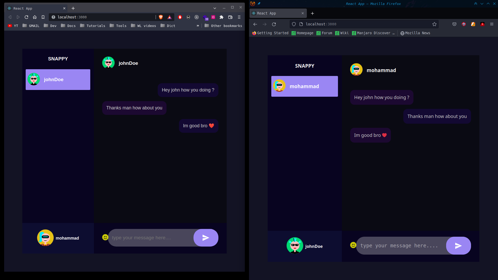

# Simple chat application

_built by React.Js , Express.js , MongoDb And Socket.Io to practice realtime communication_  

Some features are
* Sending emojis
* Pick rando, avatar image online from and api
* realtime communication with all application users

